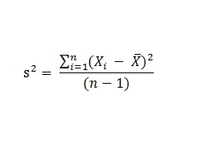
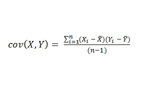
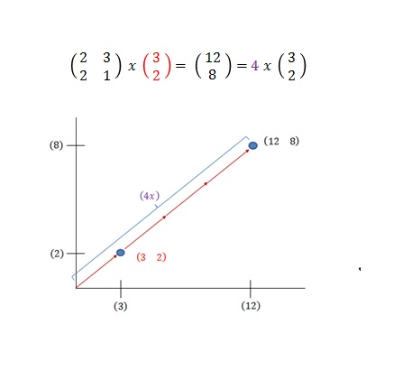

## Some Background Mathematics (it will make it it easier, promise!)

First we need to remember some basics background mathematics to understand what a PCA actually does. This might be quite simple, and a lot of what we have done in class will show up again, but it will help to understand the process of Principal component analysis.

Things you need to remember throughout this module are:

- Variance
- Covariance and Covariance Matrix
- Eigenvalues/ Eigenvectors

### 2) Variance
Besides Standard deviation, Variance is another measure of how spread. It is almost identical to the standard deviation, in fact it is simply the standard deviation squared. R has a build-in functon called var(), and we have derived variance in earlier sections of this course. We will need this information to cover the next section, covariance.



```{r}
x1<-c(0,8,12,10)
x2<-c(8,9,11,12)
Vars<-cbind(var(x1), var(x2))
colnames(Vars)<-c("Var X1", "Var X2")
Vars
```

### 3) Covariance
SD and Variance are purely one-dimensional, like heights of all monkeys in a cage or heights of all students in this room. However throughout this course we have repeatedly seen datasets with more than one dimension and usually the aim of our analysis is to describe relationships between those dimensions. For instance our dataset includes the height of all monkeys in a cage but also the femur length and we want to find out if femure length is related to height of the animals. Covariance is a simple way to find out how dimensions vary from the mean with respect to each other. In other words we multiply the difference between each value of the first vector and the mean of the vector by the difference between each value of the second vector and its respective mean, add all these up and divide by (n-1). Again, R has a build in function cov/()



```{r}
cov(x1,x2)
```

Recall that covariance is measured between two dimensions. if we have a dataset with more than 2 dimensions there is more than one covariance measurment that can be calculated. An example is a three dimensional dataset with dimensions x, y, z one could calculate cov(x,y), cov(x,z), cov(z,y). If we calculate all the possible combinations of covariance between the dimensions and put them in a matrix we obtain a covariance matrix (again we can use the cov() function for this).


```{r}
x<-c(1,3,6,4)
y<-c(30,20,10,18)
z<-c(0.3,0.7,0.5,0.4)
M<-cbind(x,y,z)
cov(M)
```

### 3) Some basic Matrix algebra leads to Eigenvector and Eigenvalues. 

Imagine we are doing Matrix multiplication. Specifically we are multiplying a matrix with a vector. If the resulting vector is an integer of the original vector we call the original vector an EIGENVECTOR, the number we have to multiply the original vector with to obtain the resulting vector is called EIGEMVALUE. The matrix functions as a transforming element, "stretching" the vector without changing its direction. Sounds confusing, it really isn't.





Important things to remember about Eigenvectors
- Eigenvectors can only be found for square matrices.
- Given a n x n matrix has eigenvectors, there are n of them. E.g. a 3x3 matrix has three Eigenvectors.
- Even if an Eigenvector is scaled before throwing it in in the transformation, it will still yield the same Eigenvalue! 
- All Eigenvectors are perpendicular, at right angles to each other. We can express data in terms of these eigenvectors!

Well, how would one find those mystical eigenvectors? It is only easy(ish) if you have small matrix. With larger Matrixes complicated iterative methods have to be used, which are beyond this course (and also beyond our scope We must admit). --> But that is why we have R and its eigen() function (:


Alright, with this knowledge we should be ready to go and learn a little bit more about Principal component analysis. PCA follows a simple recipe:

(1) Get some data (or in our case make some up).
We will only use two dimensions in this example so we can plot the data at each step to show what the PCA analysis is doing at each step. Imagine we went to a bat cave and we measured eyesize and nostrile size of different individuals. 

```{r}
# create a dataset
Bat.eyesize<-c(2.5, 0.5,2.2,1.9,3.1,2.3,2,1,1.5,1.1)
Bat.nostrils<-c(2.4,0.7,2.9,2.2,3.0,2.7,1.6,1.1,1.6,0.9)
Dataset<-cbind(Bat.eyesize, Bat.nostrils)
Dataset<-as.data.frame(Dataset)
head(Dataset)

# let's just plot them for fun
library(ggplot2)
p<-ggplot(Dataset, aes(x=Bat.eyesize, y=Bat.nostrils))
p<-p+geom_point(color="red", size=2)
p<-p+labs(y="Bat nostril size", x= "Bat eyesize")
p<-p+theme_bw()
p
```

(2) For a PCA to work properly we have to substract the mean from each of the data dimensions (this normalization is the first step and we have done it many times before). The means substracted are the average across each dimension. We will add the adjusted values to the original dataset in the first part of the code and then plot the data to see how things have changed.  

```{r}
Dataset$Bat.eyesize.adjust<-(Dataset$Bat.eyesize-mean(Dataset$Bat.eyesize))
Dataset$Bat.nostrils.adjust<-(Dataset$Bat.nostrils-mean(Dataset$Bat.nostrils))
head(Dataset)

p<-ggplot(Dataset, aes(x=Bat.eyesize.adjust, y=Bat.nostrils.adjust))
p<-p+geom_point(color="red", size=2)
p<-p+coord_fixed()
p<-p+labs(y="Bat nostril size", x= "Bat eyesize")
p<-p+theme_bw()
p<-p+geom_vline(xintercept=0)
p<-p+geom_hline(yintercept=0)
p
```

(3) Calculate the covariance matrix. Again this is pretty simple using the cov() function in R. Since the data is two dimensional, the covariance matrix will be 2 x 2. 
```{r}
covM<-cov(Dataset[,c(1,2)]) # Only picking the original values from the Dataset
covM
```
-> See that the non-diagonal elements in the covariance matrix are positive, we should expect that both x and y increase together!

(4) Next the PCA will calculate the Eigenvectors and Eigenvalues of our Covariance matrix. We can use the build-in function eigen() for this process. Again, the calculations get very complicated, especially once the dimensionality of the matrix increases. For visualization we will extract the eigenvectors and plot them with our data.
Since we have two points for each eigenvector (origin (0,0) and its actual value we can calculate slope!)

Formula 

```{r}
Eigen<-eigen(covM)
Eigen
Eigen$slopes[1]<-Eigen$vectors[1,1]/Eigen$vectors[2,1]
Eigen$slopes[2]<-Eigen$vectors[1,2]/Eigen$vectors[2,2]
head(Eigen)

p<-ggplot(Dataset, aes(x=Bat.eyesize.adjust, y=Bat.nostrils.adjust))
p<-p+geom_point(color="red", size=2)
p<-p+coord_fixed()
p<-p+labs(y="Bat nostril size", x= "Bat eyesize")
p<-p+theme_bw()
p<-p+geom_vline(xintercept=0)
p<-p+geom_hline(yintercept=0)
p<-p+geom_abline(intercept = 0, slope = Eigen$slopes[1], colour = "green")  
p<-p+geom_abline(intercept = 0, slope = Eigen$slopes[2], colour = "red")
p
```
If you look at the figure you can see that the data has quite a strong pattern. As expected from the covariance matrix the two variables do indeed increase together. The plot also shows the two eigenvectors which are perpendicular to each other. One goes through the middle of the points like drawing a line of best fit (green)! That Eigenvector is showing how related the two data sets are along that line. The second Eigenvector (red) gives us the other, less important pattern: All the points follow the main line (most variance), but are off the side of the main line by some amount (second most variance).


(5) Choosing components
The eigenvector with the highest eigenvalue is also called the first principle component of the data set (PC 1). In our example it is represented by the green line. It is the most significant relationship between the data dimensions. Therefore in the next step the PCA orders the eigenvectors by eigenvalue from highest to lowest (again, remember the eigenvalue is pretty much a measure of length!), and we can decide to ignore components of lesser significance. If you leave components out, the final dataset will have less dimensions than the original one! There are several diagnostic tools for PC selection and we will talk about one of them later. 

Below you will see how we picked both eigenvectors (PC 1 and 2) from our result derived with the eigen() function. 

Formula

```{r}
feat.vec<-Eigen$vectors
feat.vec
```

Some additional calculations:
From our covariance matrix, we know the variance of both variables. This allows us to calculate the contribution of each variable to the total variance. 
E.g

(6) Deriving the new data set 
This is the final step in the PCA, the calculation of our PCA scores. We have choosen the components that we wish to keep in our data and formed feature vectors, we simply take the transpose of the vector and multiply it on the left of the original data set transposed.


```{r}
feat.vec.tr<-t(feat.vec)
feat.vec.tr
row_data_adj<-t(Dataset[,3:4])
PCA_scores<-data.frame(t(feat.vec.tr%*%row_data_adj))
names(PCA_scores)<-c("x", "y")
PCA_scores
```

First, lets see what happens if we use both Eigenvectors (both principal components)
```{r}
p<-ggplot(PCA_scores, aes(x=x, y=y))
p<-p+geom_point(color="red", size=2)
p<-p+labs(y="Principal Component 2", x= "Principal Component 1")
p<-p+theme_bw()
p<-p+geom_vline(xintercept=0, color="red")
p<-p+geom_hline(yintercept=0, color="green")
p
```

Now, we can see what happens if we remove the second, less significant Principal component. 
```{r}
x.values<-PCA_scores$x
x.values<-as.data.frame(cbind(x.values, rep(0,10)))
names(x.values)<-c("x", "m")
x.values

plot(0,1.5,type="n",axes=FALSE, ann=FALSE, xlim=c(-1.5,1.5), ylim=c(0,1.5))
axis(1)
title(xlab="Principal Component 1")
points(x.values$x, x.values$m, col="black", cex=2, pch=16)
```

This function and plot is mostly eyecandy but we can see that we got rid of one uneccessary dimension (from 2 dimensions to one)! Hooray! So here is what the PCA did. It transformed our data so that it is expressed in terms of the patterns between them, where the patterns are the lines that most closely describe the relationship between the data. In the plot you can see above the original data solely in terms of the vectors we chose. We have changed our data from being in terms of axes x an y and now they are in terms of our 2 eigenvectors. In the case of when the data has reduced dimensionality, ie. we have left some the eigenvectors out, the new data is only shown based on the vectors we decided to keep! 
